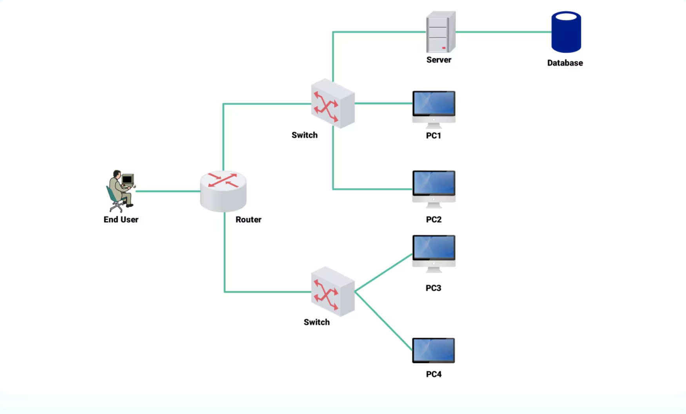
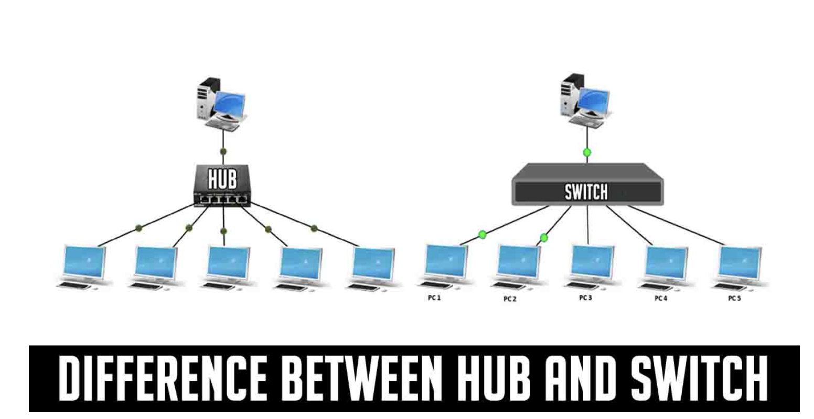
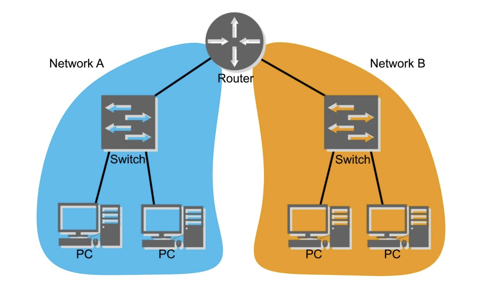
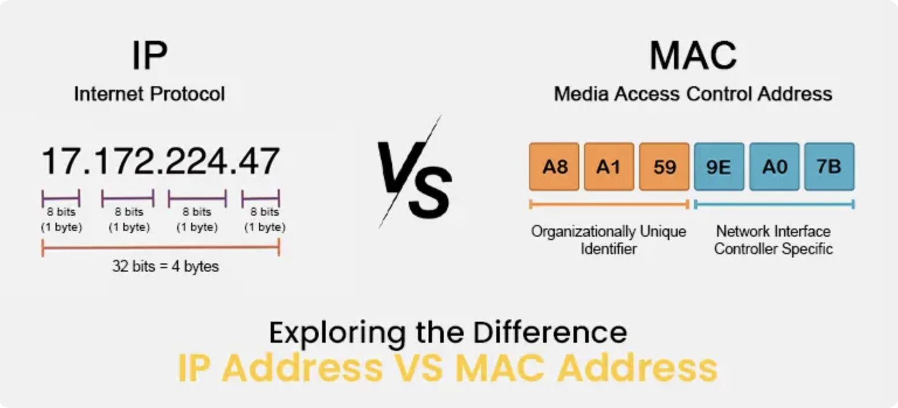

# 네트워크 기초 (Network Basics) - 2025-09-05

## 네트워크란?
- 여러 장치를 연결해 데이터를 주고받는 구조
- LAN(집/회사), WAN(넓은 지역망), Internet(전 세계망)

## 기본 장비
### 허브 vs 스위치
- **허브(Hub)**: 모든 포트로 데이터 전달 → 충돌 발생
- **스위치(Switch)**: 목적지 MAC 주소 기반 전달 → 충돌 줄어듦

### 라우터(Router)
- 네트워크와 네트워크를 연결, IP 주소 기반 경로 결정

## 주소
- **MAC 주소**: 하드웨어 고유 식별자
- **IP 주소**: 네트워크 상 위치(논리 주소)

## 오늘의 회고
- 네트워크 = 단순히 인터넷이 아니라 **장비 + 주소 + 연결 방식**의 조합이라는 걸 이해함.
- 기초지만 전체 그림을 먼저 잡는 게 중요하다고 느낌.
