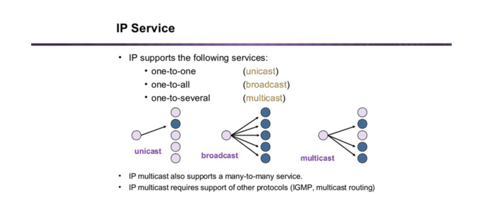
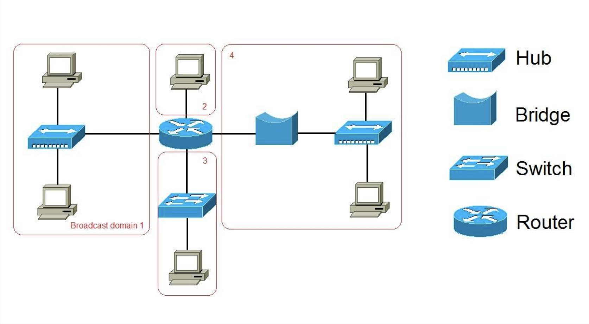

## TIL (2025-09-10)

### 브로드캐스트 도메인 (Broadcast Domain)

#### 1. 먼저, 브로드캐스트란?
- 네트워크에서 한 장치가 메시지를 보낼 때 **네트워크에 연결된 모든 장치에게 뿌리는 방식**을 말한다.  
- 쉽게 정리하면:
  - **유니캐스트 (Unicast)**: 나 → 너 (1:1)
  - **멀티캐스트 (Multicast)**: 나 → 특정 그룹 (예: 동아리 단톡방)
  - **브로드캐스트 (Broadcast)**: 나 → 이 네트워크에 있는 모두 (예: 교실 전체에 방송)

---

#### 2. 브로드캐스트 도메인의 정의
- 같은 브로드캐스트 메시지를 받을 수 있는 장치들의 집합.  
- 즉, “내가 외쳤을 때 소리가 닿는 범위.”

---

#### 3. 특징
- **허브(Hub)**: 모든 포트가 같은 브로드캐스트 도메인 → 트래픽 많아짐.  
- **스위치(Switch)**: 기본적으로는 허브랑 비슷하지만, VLAN으로 쪼갤 수 있음.  
- **라우터(Router)**: 브로드캐스트 메시지를 다른 네트워크로 전달하지 않음 → 도메인을 나누는 경계.

---

#### 4. 왜 중요할까?
- 브로드캐스트 도메인이 커지면 불필요한 트래픽 폭증 → 네트워크 느려짐.  
- 도메인을 잘게 나누면 효율적이고 보안적으로도 더 안전하다.

---

#### 5. 비유
- 학교 방송으로 생각하면 쉽다:  
  - 한 반 교실 안에서만 들리는 방송 = 하나의 브로드캐스트 도메인  
  - 옆 반은 못 듣는다 = 라우터로 나뉜 다른 도메인
 
---

### 오늘의 회고
- 네트워크 기초 개념(허브/스위치/라우터, IP & MAC)에 이어 브로드캐스트 도메인을 정리했다.  
- 그림 + 교실 방송 비유를 쓰니까 확실히 머리에 잘 들어왔다.  
- 단순히 강의 듣는 것보다 직접 글로 풀어내니 “내 언어”로 이해하는 느낌이 든다.  
- 앞으로도 하나씩 차근차근 기록하면서 개념을 내 걸로 만들자!
