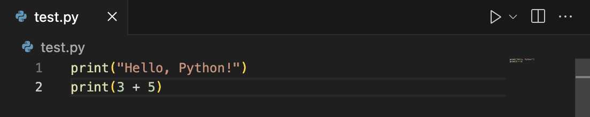
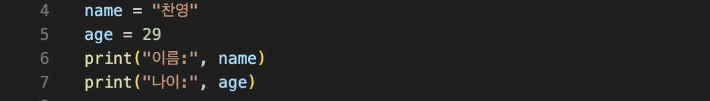
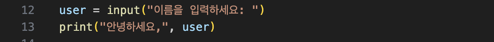
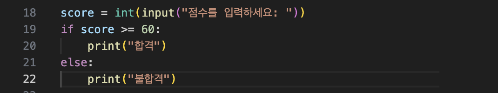

# 🐍 Python 기초 연습 (첫 TIL)

📅 2025-09-19  

오늘은 Python의 가장 기초적인 문법을 연습했다.  
`print()`, `변수`, `input()`, `if ~ else` 문을 사용해 간단한 프로그램을 작성해봤다.  

---

## ✨ 1. 출력하기 (`print`)



👉 **실행 결과**
```
Hello, Python!
8
```

---

## ✨ 2. 변수 사용하기



👉 **실행 결과**
```
이름: 찬영
나이: 29
```

---

## ✨ 3. 사용자 입력 받기 (`input`)



👉 **실행 예시**
```
이름을 입력하세요: 찬영
안녕하세요, 찬영
```

---

## ✨ 4. 입력값을 숫자로 변환하기 (`int(input())`)


👉 **실행 예시**
```
숫자를 입력하세요: 7
두 배는: 14
```

---

## ✨ 5. 조건문 (`if ~ else`)



👉 **실행 예시**
```
점수를 입력하세요: 75
합격
```

```
점수를 입력하세요: 45
불합격
```

---

## 📌 오늘 배운 핵심
- `print()` → 출력하기  
- `변수` → 값을 저장하는 상자  
- `input()` → 사용자 입력 받기  
- `int()` → 입력값을 숫자로 변환  
- `if ~ else` → 조건에 따라 다른 코드 실행  

---

## 📝 오늘의 회고
오늘은 **출력, 변수, 입력, 조건문**까지 다뤘다.  
단순한 코드지만 직접 실행해보니 **“내가 만든 프로그램”** 같은 느낌이 들어서 뿌듯했다 😎  
앞으로는 반복문(`for`, `while`)과 함수(`def`)까지 확장해서 더 다양한 프로그램을 만들어볼 예정이다.
